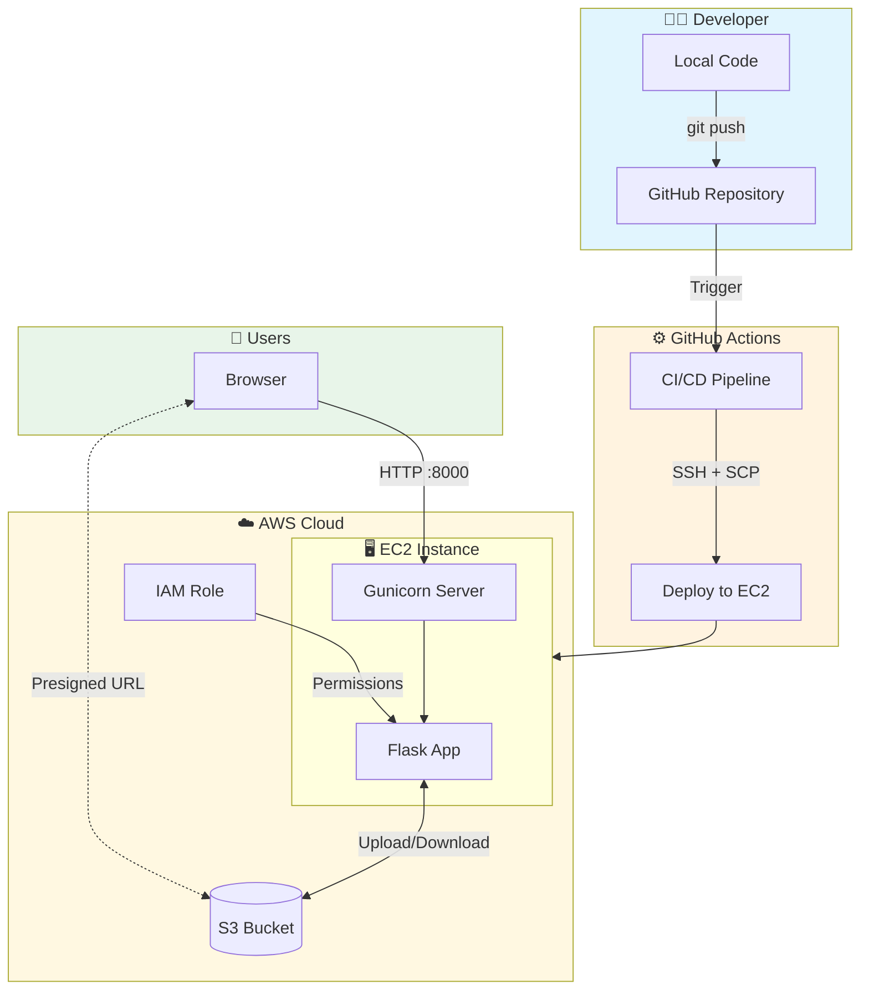
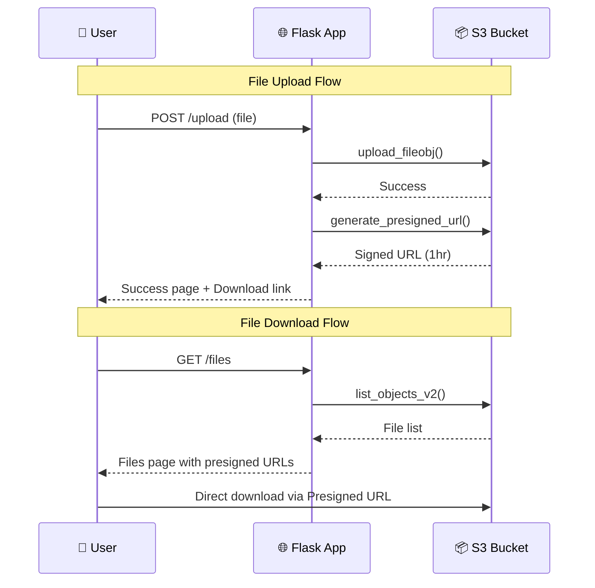

# � KnoxDrive – Secure Cloud Storage

<div align="center">


**A modern, secure file storage solution powered by AWS S3 with automated CI/CD deployment.**

[Features](#-features) • [Architecture](#-architecture) • [Setup](#-setup) • [Deployment](#-cicd-pipeline) • [Security](#-security)

</div>

---

## ✨ Features

| Feature                | Description                                      |
|------------------------|--------------------------------------------------|
| 🎨 **Modern UI**       | Glassmorphism design with drag-and-drop upload   |
| 📁 **File Management** | Upload, list, download, and delete files easily  |
| 🔒 **Secure Access**   | Presigned URLs with 1-hour expiration            |
| 🚀 **Auto Deploy**     | Push to `main` → Auto-deployed to EC2            |
| ☁️ **Cloud Native**    | Built for AWS with IAM role-based security       |

---

## 🏗️ Architecture



---

## 📦 Request Flow



---

## 🛠️ Setup

### Prerequisites
- AWS Account
- GitHub Account
- SSH Key Pair (`.pem` file)

### 1️⃣ Create S3 Bucket
```
Name: knoxdrive-demo (or your choice)
Region: ap-south-1
Access: Block all public access ✓
```

### 2️⃣ Create IAM Role for EC2
1. Go to **IAM → Roles → Create Role**
2. Select **EC2** as trusted entity
3. Attach policy: `AmazonS3FullAccess`
4. Name: `KnoxDrive-EC2-Role`

### 3️⃣ Launch EC2 Instance
| Setting          | Value                        |
|------------------|------------------------------|
| AMI              | Amazon Linux 2023            |
| Instance Type    | t2.micro (Free Tier)         |
| IAM Role         | `KnoxDrive-EC2-Role`         |
| Security Group   | SSH (22), Custom TCP (8000)  |

### 4️⃣ Configure GitHub Secrets
Go to **Repository → Settings → Secrets → Actions** and add:

| Secret             | Value                          |
|--------------------|--------------------------------|
| `EC2_SSH_KEY`      | Content of your `.pem` file    |
| `EC2_PUBLIC_IP`    | Your EC2 Public IP             |
| `S3_BUCKET_NAME`   | Your S3 bucket name            |
| `AWS_REGION`       | `ap-south-1`                   |

---

## 🚀 CI/CD Pipeline

```mermaid
flowchart LR
    A[📝 Push to main] --> B[🔄 GitHub Actions]
    B --> C[📦 Checkout Code]
    C --> D[🔑 Setup SSH]
    D --> E[📤 SCP to EC2]
    E --> F[📥 Install pip3]
    F --> G[📚 Install Dependencies]
    G --> H[⚙️ Create .env]
    H --> I[🛠️ Setup systemd]
    I --> J[🚀 Restart Service]
    J --> K[✅ App Live!]
    
    style A fill:#c8e6c9
    style K fill:#a5d6a7
```



### What Happens on `git push`:
1. ✅ Code copied to EC2 via SCP
2. ✅ pip3 installed (if missing)
3. ✅ Python dependencies installed
4. ✅ `.env` file created with secrets
5. ✅ Gunicorn service configured
6. ✅ App restarted and running!

---

## � Local Development

```bash
# Clone the repo
git clone https://github.com/your-username/knoxdrive.git
cd knoxdrive

# Create .env file
cat > .env << EOF
AWS_ACCESS_KEY_ID=your-access-key
AWS_SECRET_ACCESS_KEY=your-secret-key
AWS_REGION=ap-south-1
S3_BUCKET=your-bucket-name
EOF

# Install dependencies
pip install -r requirements.txt

# Run the app
python app.py
```

Access at: **http://localhost:5000**

---

## 🔒 Security

| Layer             | Protection                            |
|-------------------|---------------------------------------|
| **Credentials**   | IAM Roles (no keys on server)         |
| **File Access**   | Presigned URLs (expire in 1 hour)     |
| **S3 Bucket**     | Private (no public access)            |
| **Network**       | Security Group (only ports 22, 8000)  |

---

## 📁 Project Structure

```
KnoxDrive/
├── .github/
│   └── workflows/
│       └── deploy.yml      # CI/CD pipeline
├── templates/
│   ├── index.html          # Upload page
│   ├── files.html          # File listing
│   └── success.html        # Upload success
├── app.py                  # Flask application
├── requirements.txt        # Python dependencies
└── README.md               # This file
```

---

## 🆕 Setting Up a New EC2

If you delete your EC2 and need to start fresh:

1. **Create new EC2** (Amazon Linux 2023)
2. **Attach IAM Role** (`KnoxDrive-EC2-Role`)
3. **Open ports** 22 and 8000 in Security Group
4. **Update GitHub Secret** `EC2_PUBLIC_IP`
5. **Push any commit** → Auto-deploys!

> 💡 **Note:** pip3, dependencies, and the service are all set up automatically by the pipeline!

---

